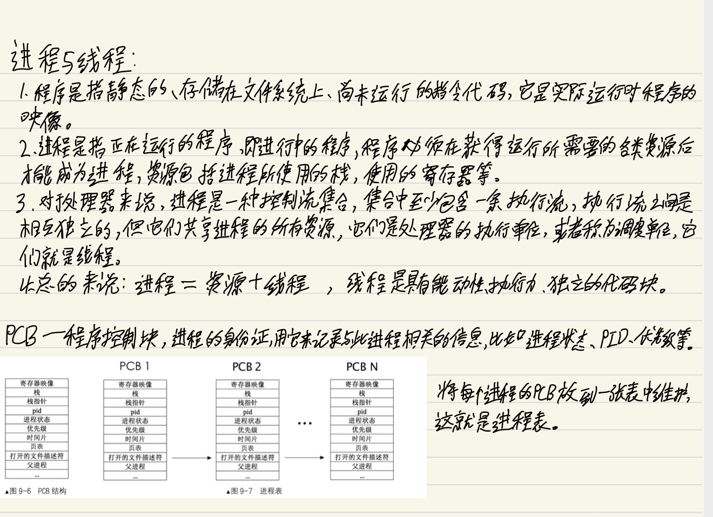

## 线程

#### 日常手书（辣眼睛😂）



#### 多线程调度

###### 程序控制块
```
/* 进程或线程的pcb,程序控制块 */
struct task_struct {
   uint32_t* self_kstack;	 // 各内核线程都用自己的内核栈
   enum task_status status;
   char name[16];
   uint8_t priority;
   uint8_t ticks;	   // 每次在处理器上执行的时间嘀嗒数

/* 此任务自上cpu运行后至今占用了多少cpu嘀嗒数,
 * 也就是此任务执行了多久*/
   uint32_t elapsed_ticks;

/* general_tag的作用是用于线程在一般的队列中的结点 */
   struct list_elem general_tag;				    

/* all_list_tag的作用是用于线程队列thread_all_list中的结点 */
   struct list_elem all_list_tag;

   uint32_t* pgdir;              // 进程自己页表的虚拟地址
   uint32_t stack_magic;	 // 用这串数字做栈的边界标记,用于检测栈的溢出
};
```
介绍一下结构体中的几个成员
- ticks，它是任务每次被调度到处理器上执行的时间嘀嗒数，也就是我们所说的任务的时间片，每次中断都会将当前任务的ticks减1，当减到0时就被换下处理器。

- priority，这个要和ticks配合使用。priority表示任务的优先级，咱们这里优先级体现在任务执行的时间片上，即优先级越高，每次任务被调度上处理器后执行的时间片就越长。当tickes递减为0时，就要被时间中断处理程序和调度器换下处理器，调度器把priority重新赋值给ticks，这样当此线程下一次又被调用时，将再次在处理器上运行ticks个时间片。
- elapsed_ticks用于记录任务在处理器上运行的时钟滴答数，从开始执行，到运行结束经历的总时钟数。
- general_tag的类型是struct list_elem，也就是general_tag是双向链表的结点。它是线程的标签，当线程被加入到就绪队列thread_ready_list或其他等待队列中时，就把该线程PCB中general_tag的地址加入队列。
- all_list_tag的类型也是structure list_elem，它用于线程被加入全部线程队列时使用。
- pgdir是任务自己的页表，线程和进程的最大区别就是进程独享自己的地址空间，即进程有自己的页表，而线程共享所在进程的地址空间，即线程无页表。如果改任务为线程，pgdir则为NULL，否则pgdir会被赋予页表的虚拟地址，注意此处是虚拟地址，页表加载时还是要被转换成物理地址的。

##### 任务调度器和任务切换
 
- 完整的调度过程需要三部分的配合
   - 时钟中断处理函数。
   - 调度器schedule。
   - 任务切换函数switch_to。

###### 时钟中断

```
/* 通用的中断处理函数,一般用在异常出现时的处理 */
static void general_intr_handler(uint8_t vec_nr) {
   if (vec_nr == 0x27 || vec_nr == 0x2f) {	// 0x2f是从片8259A上的最后一个irq引脚，保留
      return;		//IRQ7和IRQ15会产生伪中断(spurious interrupt),无须处理。
   }
  /* 将光标置为0,从屏幕左上角清出一片打印异常信息的区域,方便阅读 */
   set_cursor(0);
   int cursor_pos = 0;
   while(cursor_pos < 320) {
      put_char(' ');
      cursor_pos++;
   }

   set_cursor(0);	 // 重置光标为屏幕左上角
   put_str("!!!!!!!      excetion message begin  !!!!!!!!\n");
   set_cursor(88);	// 从第2行第8个字符开始打印
   put_str(intr_name[vec_nr]);
   if (vec_nr == 14) {	  // 若为Pagefault,将缺失的地址打印出来并悬停
      int page_fault_vaddr = 0; 
      asm ("movl %%cr2, %0" : "=r" (page_fault_vaddr));	  // cr2是存放造成page_fault的地址
      put_str("\npage fault addr is ");put_int(page_fault_vaddr); 
   }
   put_str("\n!!!!!!!      excetion message end    !!!!!!!!\n");
  // 能进入中断处理程序就表示已经处在关中断情况下,
  // 不会出现调度进程的情况。故下面的死循环不会再被中断。
   while(1);
}


/* 时钟的中断处理函数 */
static void intr_timer_handler(void) {
   struct task_struct* cur_thread = running_thread();

   ASSERT(cur_thread->stack_magic == 0x19870916);         // 检查栈是否溢出

   cur_thread->elapsed_ticks++;	  // 记录此线程占用的cpu时间嘀
   ticks++;	  //从内核第一次处理时间中断后开始至今的滴哒数,内核态和用户态总共的嘀哒数

   if (cur_thread->ticks == 0) {	  // 若进程时间片用完就开始调度新的进程上cpu
      schedule(); 
   } else {				  // 将当前进程的时间片-1
      cur_thread->ticks--;
   }
}

```

###### 调度器schedule 

```
/* 实现任务调度 */
void schedule() {

   ASSERT(intr_get_status() == INTR_OFF);

   struct task_struct* cur = running_thread(); 
   if (cur->status == TASK_RUNNING) { // 若此线程只是cpu时间片到了,将其加入到就绪队列尾
      ASSERT(!elem_find(&thread_ready_list, &cur->general_tag));
      list_append(&thread_ready_list, &cur->general_tag);
      cur->ticks = cur->priority;     // 重新将当前线程的ticks再重置为其priority;
      cur->status = TASK_READY;
   } else { 
      /* 若此线程需要某事件发生后才能继续上cpu运行,
      不需要将其加入队列,因为当前线程不在就绪队列中。*/
   }

   ASSERT(!list_empty(&thread_ready_list));
   thread_tag = NULL;	  // thread_tag清空
/* 将thread_ready_list队列中的第一个就绪线程弹出,准备将其调度上cpu. */
   thread_tag = list_pop(&thread_ready_list);   
   struct task_struct* next = elem2entry(struct task_struct, general_tag, thread_tag);
   next->status = TASK_RUNNING;
   switch_to(cur, next);
}

#define offset(struct_type,member) (int)(&((struct_type*)0)->member)

#define elem2entry(struct_type, struct_member_name, elem_ptr) \
(struct_type*)((int)elem_ptr - offset(struct_type, struct_member_name))

```
- 参数 elem_ptr 是待转换的地址，它属于某个结构体中某个成员的地址，参数struct_member_name 是 elem_ptr 所在结构体中对应地址的成员名字，也就是说参数 struct_member_name 是个字符串，参数 struct_type 是 elem_ptr 所属的结构体的类型。宏 elem2entry 的作用是将指针 elem_ptr 转换成 struct_type 类型的指针，其原理是用 elem_ptr 的地址减去 elem_ptr 在结构体 struct_type 中的偏移量，此地址差便是结构体 struct_type 的起始地址， 最后再将此地址差转换为 struct_type 指针类型。
- elem2entry的原理：
   - 用结构体成员的地址减去成员在结构体中的偏移量，先获取到结构体起始地址。
   - 再通过强制类型转换将第一步中的地址转换为结构体类型。 

###### 任务切换函数switch_to 

- 为什么要保护任务上下文？
   - 每个任务都有个执行流，这都是事先规划好的执行路径，按道理应该是从头执行到结束。不过实际的 情况是执行流经常被临时改道，突然就执行了规划外的指令，这在多任务系统中是很正常的，因为操作系统是由中断驱动的，每一次中断都将使处理器放下手头的工作转去执行中断处理程序。
   - 为了在中断处理完 成后能够恢复任务原有的执行路径，必须在执行流被改变前，将任务的上下文保护好。执行流被改变后，在其后续的执行过程中还可能会再次发生被改变“流向”的情况，也就是说随着执行的深入，这种改变的深度很可能是多层的。如果希望将来能够返回到本层的执行流，依然要在改变前保护好本层的上下文。
   - 总之，凡是涉及到执行流的改变，不管被改变了几层，为了将来能够恢复到本层继续执行，必须在改变发生前将本层执行流的上下文保护好。因此，执行流被改变了几层就要做几次上下文保护，如下图所示。
     
      
      
   - 在咱们的系统中，任务调度是由时钟中断发起，由中断处理程序调用 switch_to 函数实现的。假设当前任 务在中断发生前所处的执行流属于第一层，受时钟中断 的影响，处理器会进入中断处理程序，这使当前的任务 执行流被第一次改变，因此在进入中断时，我们要保护 好第一层的上下文，即中断前的任务状态。之后在内核 中执行中断处理程序，这属于第二层执行流。当中断处 理程序调用任务切换函数 switch_to 时，当前的中断处理程序又要被中断，因此要保护好第二层的上下文，即中断处理过程中的任务状态。 

   - 总结：
     - 上下文保护的第一部分负责保存任务进入中断前的全部寄存器，目的是能让任务恢复到中断前。
     - 上下文保护的第二部分负责保存这四个寄存器：esi、edi、ebx和ebp，目的是能让任务恢复执行在任务切换发生时剩下尚未执行的内核代码，保证顺利走到退出中断的出口，利用第一部分保护的寄存器环境彻底恢复任务。

上代码：

```
[bits 32]
section .text
global switch_to
switch_to:
   ;栈中此处是返回地址	       
   push esi
   push edi
   push ebx
   push ebp

   mov eax, [esp + 20]		 ; 得到栈中的参数cur, cur = [esp+20]
   mov [eax], esp                ; 保存栈顶指针esp. task_struct的self_kstack字段,
				 ; self_kstack在task_struct中的偏移为0,
				 ; 所以直接往thread开头处存4字节便可。
;------------------  以上是备份当前线程的环境，下面是恢复下一个线程的环境  ----------------
   mov eax, [esp + 24]		 ; 得到栈中的参数next, next = [esp+24]
   mov esp, [eax]		 ; pcb的第一个成员是self_kstack成员,用来记录0级栈顶指针,
				 ; 用来上cpu时恢复0级栈,0级栈中保存了进程或线程所有信息,包括3级栈指针
   pop ebp
   pop ebx
   pop edi
   pop esi
   ret				 ; 返回到上面switch_to下面的那句注释的返回地址,
				 ; 未由中断进入,第一次执行时会返回到kernel_thread
``` 

- switch_to函数接受两个参数，第一个参数是当前线程cur，第二个参数是下一个上处理器的线程，此函数的功能是保存cur线程的寄存器映像，将下一个线程next的寄存器映像装载到处理器。
- 栈情况图

  
  
- 第 11 行的“mov eax, [esp + 20]”，结合上图可发现，其中“[esp + 20]”是为了获取栈中 cur 的值， 也就是当前线程的 PCB 地址，再将它 mov 到寄存器 eax 中，因为 self_kstack 在 PCB 中偏移为 0，所以此 时 eax 可以认为是当前线程 PCB 中 self_kstack 的地址。

- 第 12 行 mov [eax], esp 将当前栈顶指针 esp 保存到当前线程 PCB 中的 self_kstack 成员中。 好啦，至此，当前线程的上下文环境算是保存完毕。下面要准备往处理器上装载新线程的上下文啦。 第 16 行“mov eax, [esp + 24]”，结合上图，其中“[esp + 24]”是为了获取栈中的 next 的值，也就是 next 线程的 PCB 地址，之后将它 mov 到寄存器 eax，同样此时 eax 可以认为是 next 线程 PCB 中 self_kstack 的地址。因此，“[eax]”中保存的是 next 线程的栈指针。
- 第 17 行“mov esp, [eax]”是将 next 线程的栈指针恢复到 esp 中，经过这一步后便找到了 next 线程的 栈，从而可以从栈中恢复之前保存过的寄存器映像。
- 接下来的第 19~22 行按照寄存器保存的逆顺序，依次从栈中弹出。


