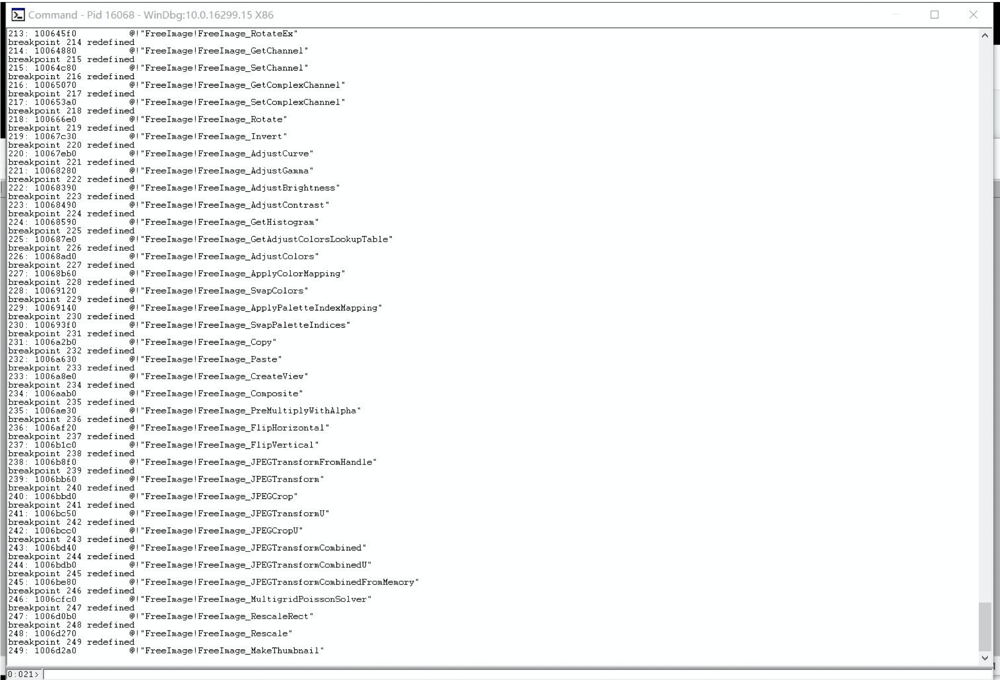
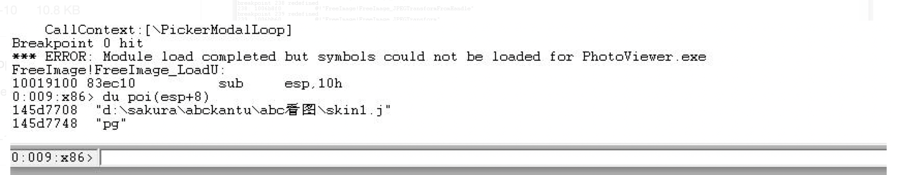
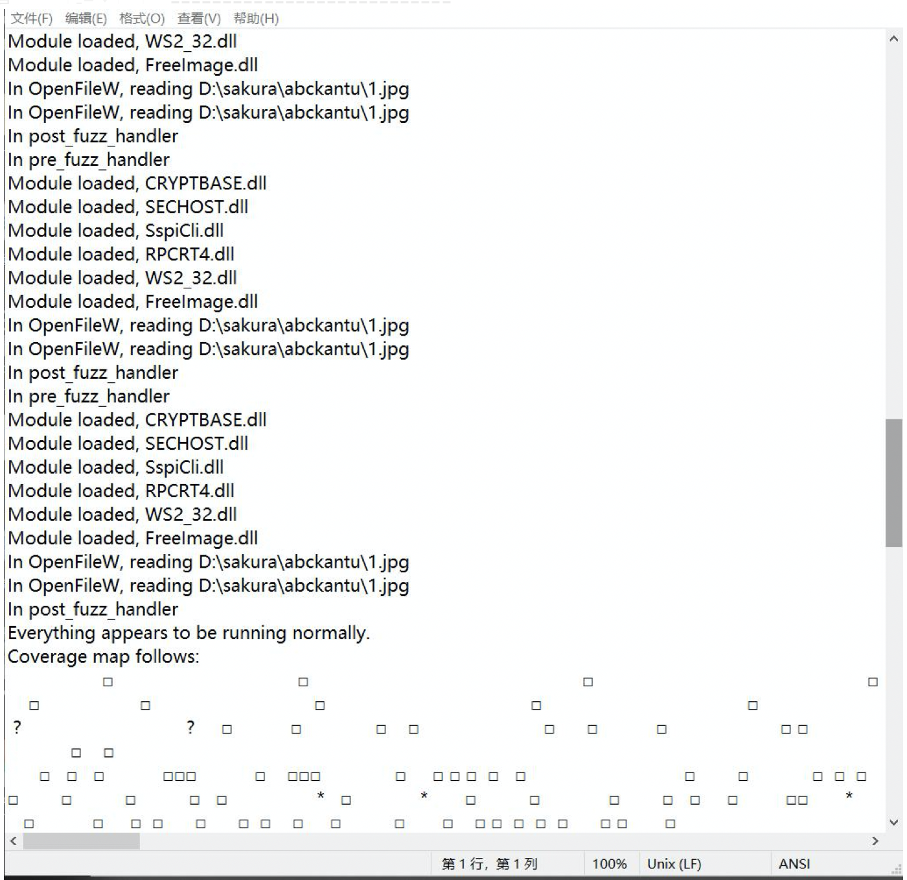

##winafl实战练习--FreeImage.dll

####目标
我选择了一款叫做ABC看图的软件，它使用的一个开源图像库-FreeImage.dll，接下来就一他为例，简单联系一下winafl的使用和harness的编写。

下图是我们的目标FreeImage.dll：


#### 寻找入手函数

我们首先用windbg调试ABC看图，找他他调用的FreeImage.dll库中的函数：
```
bm FreeImage!* ".echo ; kb 1; gc"
```
效果如下图：


我们把他导出到txt，之后再写一个python脚本来提取一下函数。

导出文件：[output.txt](./output.txt)

提取脚本：[find.py](./find.py)

最终结果：[outputOUT.txt](./outputOUT.txt)

调试可以发现，在进行获取图片大小、宽度以及其他图片信息时，都会调用FreeImage!FreeImage_LoadU函数。所以我们接下来就对他做一个分析。

可以通过下断点查看栈信息的操作来得到FreeImage!FreeImage_LoadU的参数信息。

如图可以看到他的第二个参数是图片的加载路径。


#### harness编写
上面我们决定针对FreeImage_LoadU来编写harness，由于他是个开源库，所以我去查看了一下他的使用手册：
中文手册：http://www.doc88.com/p-4089059650045.html

[harness](./harness.cpp)

简单介绍一下编写的思路：

- extern "C" __declspec(dllexport) int main(int argc, char** argv);
他的作用是，使我们之后fuzz的过程中能够使用target_method参数。

- 程序中的函数是通过GetProcAddress函数来获取的，我们将他的返回值保存为全局变量，并将他和要测试的函数（FreeImage_test）分离，这样我们就可以只测试FreeImage_test而不是整个程序，极大地提高了fuzz的速度。
- FreeImage_Initialise 函数用于初始化 FreeImage库，FreeImage_LoadU 的第一个参数由 FreeImage_GetFileTypeU 获取，表明为图片的类型，FreeImage_Unload 函数用来卸载位图，FreeImage_DeInitialise 函数用来卸载FreeImage库。

#### 测试
首先先看看winafl能否正常运行：
```
D:\fuzz\DynamoRIO\bin32\drrun.exe -c winafl.dll -debug -coverage_module FreeImage.dll -target_module test.exe -target_method main -fuzz_iterations 10 -nargs 2 -- D:\fuzz\abckantu\test.exe D:\fuzz\abckantu\1.jpg
```
我们查看生成的日志，如下图：

可以看到我们的模块被正常执行了，我们也就可以继续进行了。


接下来筛选一波测试文件，大部分是在github的语料库嫖的。
```
python winafl-cmin.py --working-dir D:\fuzz\winafl\build32\bin\Release -D D:\fuzz\DynamoRIO\bin32 -t 100000 -i D:\fuzz\abckantu\input -o D:\fuzz\abckantu\out -coverage_module FreeImage.dll -target_module test.exe -target_method main -nargs 2 -- D:\fuzz\abckantu\test.exe @@
```

最后就可以运行winafl来等crash了：
```
afl-fuzz.exe -i D:\fuzz\abckantu\out -o D:\fuzz\abckantu\result -D D:\fuzz\DynamoRIO\bin32 -t 20000 -- -coverage_module FreeImage.dll -target_module test.exe -target_offset 0x1040 -fuzz_iterations 5000 -nargs 2 --  D:\fuzz\abckantu\test.exe @@
```