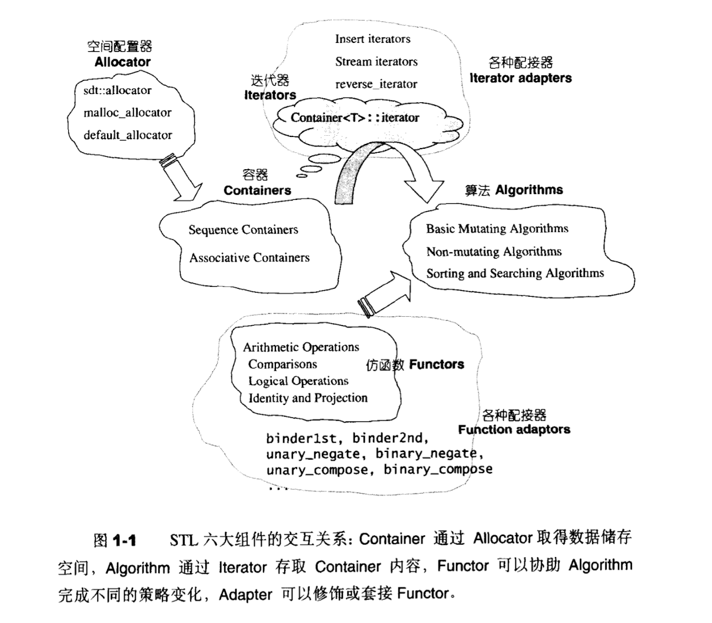
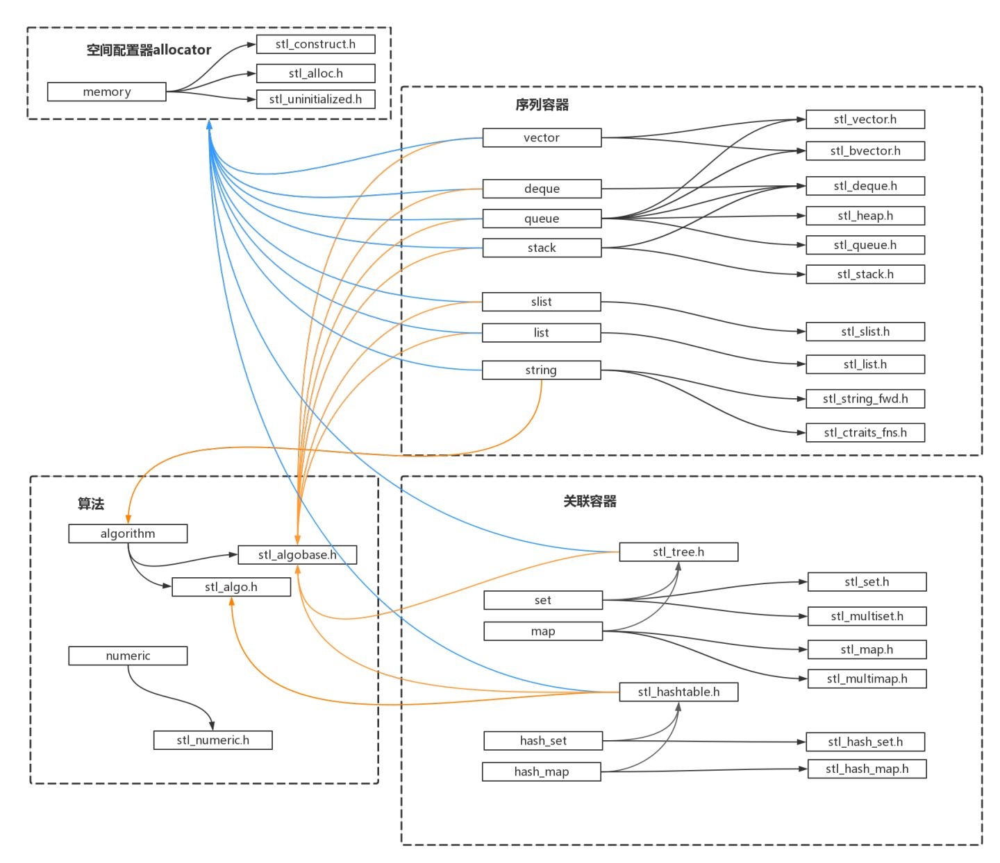

# 简单记录一下自己在stl学习过程中学到的知识

#### 简单概述
1. STL六大组件：
  - 容器(container)：常用数据结构，大致分为两类，序列容器，如vector，list，deque，关联容器，如set，map。在实现上，是类模板(class template)
  
  - 迭代器(iterator)：一套访问容器的接口，行为类似于指针。它为不同算法提供的相对统一的容器访问方式，使得设计算法时无需关注过多关注数据。（“算法”指广义的算法，操作数据的逻辑代码都可认为是算法）
  - 算法(algorithm)：提供一套常用的算法，如sort，search，copy，erase … 在实现上，可以认为是一种函数模板(function template)。
  - 配置器(allocator)：为容器提供空间配置和释放，对象构造和析构的服务，也是一个class template。
  - 仿函数(functor)：作为函数使用的对象，用于泛化算法中的操作。
  - 配接器(adapter)：将一种容器修饰为功能不同的另一种容器，如以容器vector为基础，在其上实现stack，stack的行为也是一种容器。这就是一种配接器。除此之外，还有迭代器配接器和仿函数配接器。
2. 六大组件的交互关系：

3. 六大组件的文件关系：

4. 一些语法基础知识(学习过程中参考的比较好的博文)
 - [静态常量整数成员在class内部直接初始化](https://www.cnblogs.com/wuchanming/p/4060540.html)
 
 - [临时对象的产生与运用](https://www.cnblogs.com/wuchanming/p/4060461.html)
 - [仿函数实现详解](https://blog.csdn.net/u010710458/article/details/79734558)
 - [increment/decrement/dereference操作符](https://www.cnblogs.com/wuchanming/p/4060585.html)
1. 泛型指针、原生指针和智能指针：
  - 泛型指针
泛型指针有多种含义。
     - (1) 指void*指针，可以指向任意数据类型，因此具有“泛型”含义。
     
     - (2) 指具有指针特性的泛型数据结构，包含泛型的迭代器、智能指针等。
广义的迭代器是一种不透明指针，能够实现遍历访问操作。通常所说的迭代器是指狭义的迭代器，即基于C++的STL中基于泛型的iterator_traits实现的类的实例。
总体来说，泛型指针和迭代器是两个不同的概念，其中的交集则是通常提到的迭代器类。

 - 原生指针就是普通指针，与它相对的是使用起来行为上象指针，但却不是指针。
     - 说“原生”是指“最简朴最基本的那一种”。因为现在很多东西都抽象化理论化了，所以“以前的那种最简朴最基本的指针”只是一个抽象概念（比如iterator）的表现形式之一。

 - 智能指针是C++里面的概念：由于 C++ 语言没有自动内存回收机制，程序员每次得自己处理内存相关问题，但用智能指针便可以有效缓解这类问题。
     - 引入智能指针可以防止出现悬垂指针的情况，一般是把指针封装到一个称之为智能指针类中，这个类中另外还封装了一个使用计数器，对指针的复制等操作将导致该计数器的值加1，对指针的delete操作则会减1，值为0时，指针为NULL
     
#### 配置器(allocator)
1. allocator除了负责内存的分配和释放，还负责对象的构造和析构
2. SGI STL的默认配置器
  - 包含三个文件：
  
  - \<stl_construct.h>：定义了全局函数construct()和destroy()，负责对象构造和析构。
  - \<stl_alloc.h>：内存配置和释放在此处实现，其内部有两级配置器，第一级结构简单，封装malloc()和free()，第二级实现了自由链表和内存池，用于提升大量小额内存配置时的性能。
  - \<stl_uninitialiezed.h>：一些用于用于填充和拷贝大块内存的全局函数。
对象构造和/析构，与内存配置/释放是分离实现的。
3. 结构图：

4. 代码可以去看下上面的代码，在代码中有相应的注释。

#### 迭代器(iterator)