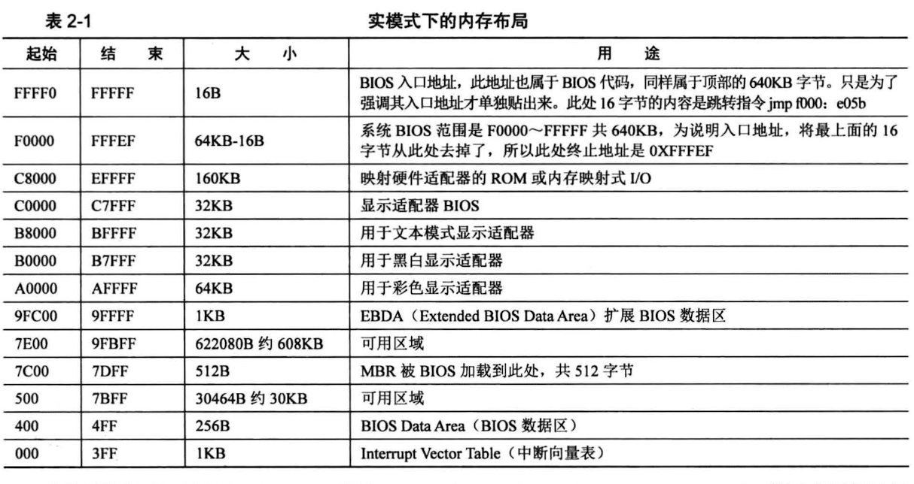

### 用到的知识
1. 实模式下的1MB内存布局：
  
  - 内存地址0～0x9FFFF的空间范围是640kb，这片地址对应了DRAM，也就是插在主板上的内存条。
  
  -  顶部的0xF0000～0xFFFFF，这64KB的内存是ROM，这里面存的就是BIOS的代码，BIOS的主要工作就是检查初始化硬件。
  -  地址映射
  

2. BIOS
  - 在开机接电的一瞬间，CPU的cs:ip寄存器就被强制初始化为了0xF000:0xFFF0，（实模式段基址*16（左移4位）+段偏移）也就是0xFFFF0，他就是BIOS的入口地址。
  
  - 0xFFFF0处存的指令是一条跳转指令：jmp far f000:e05b，他跳转到了0xfe05b处，这里是BIOS代码真正开始的地方，接下来BIOS就会开始检测内存、显卡等外设信息，并初始化硬件，在内存0x000～0x3FF处建立数据结构，中断向量表IVT并填写中断例程。

3. MBR
    - BIOS最后一项工作校验启动盘中位于0盘0道1扇区的内容。如果扇区末尾的两个字节分别是魔数0x55和0xaa，BIOS就会认为存在可执行程序（也就是MBR），便加载到物理地址0x7c00，跳转到此处继续执行。
    
    - 注意：BIOS跳转到0x7c00是使用了：jmp 0:0x7c00，这是jmp的直接绝对远转移用法，段寄存器会被替换为0。


### 有注释版的代码：
```
;主引导程序 
;------------------------------------------------------------
SECTION MBR vstart=0x7c00         
   mov ax,cs      
   mov ds,ax
   mov es,ax
   mov ss,ax
   mov fs,ax
   mov sp,0x7c00

; 清屏 利用0x06号功能，上卷全部行，则可清屏。
; -----------------------------------------------------------
;INT 0x10   功能号:0x06	   功能描述:上卷窗口
;------------------------------------------------------
;输入：
;AH 功能号= 0x06
;AL = 上卷的行数(如果为0,表示全部)
;BH = 上卷行属性
;(CL,CH) = 窗口左上角的(X,Y)位置
;(DL,DH) = 窗口右下角的(X,Y)位置
;无返回值：
   mov     ax, 0x600
   mov     bx, 0x700
   mov     cx, 0           ; 左上角: (0, 0)
   mov     dx, 0x184f	   ; 右下角: (80,25),
			   ; VGA文本模式中,一行只能容纳80个字符,共25行。
			   ; 下标从0开始,所以0x18=24,0x4f=79
   int     0x10            ; int 0x10

;;;;;;;;;    下面这三行代码是获取光标位置    ;;;;;;;;;
;.get_cursor获取当前光标位置,在光标位置处打印字符.
   mov ah, 3		; 输入: 3号子功能是获取光标位置,需要存入ah寄存器
   mov bh, 0		; bh寄存器存储的是待获取光标的页号

   int 0x10		; 输出: ch=光标开始行,cl=光标结束行
			; dh=光标所在行号,dl=光标所在列号

;;;;;;;;;    获取光标位置结束    ;;;;;;;;;;;;;;;;

;;;;;;;;;     打印字符串    ;;;;;;;;;;;
   ;还是用10h中断,不过这次是调用13号子功能打印字符串
   mov ax, message 
   mov bp, ax		; es:bp 为串首地址, es此时同cs一致，
			; 开头时已经为sreg初始化

   ; 光标位置要用到dx寄存器中内容,cx中的光标位置可忽略
   mov cx, 5		; cx 为串长度,不包括结束符0的字符个数
   mov ax, 0x1301	; 子功能号13是显示字符及属性,要存入ah寄存器,
			; al设置写字符方式 ah=01: 显示字符串,光标跟随移动
   mov bx, 0x2		; bh存储要显示的页号,此处是第0页,
			; bl中是字符属性, 属性黑底绿字(bl = 02h)
   int 0x10		; 执行BIOS 0x10 号中断
;;;;;;;;;      打字字符串结束	 ;;;;;;;;;;;;;;;

   jmp $		; 使程序悬停在此

   message db "1 MBR"
   times 510-($-$$) db 0
   db 0x55,0xaa

```