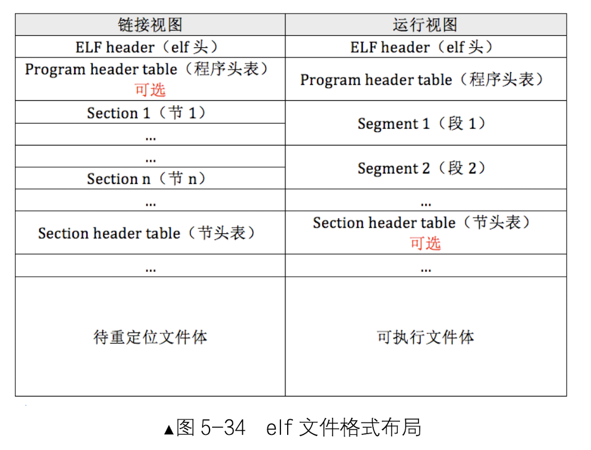

## 整体梳理

##### 第0章

主要就是补充了一些基础知识，大部分应该都接触过，可以快速的浏览一下。

##### 第1章

环境搭建
- gcc
- nasm
- bochs

配置bochs
这部分貌似没什么坑，我是用的ubuntu 18，可以按书上的流程把环境搭起来。

##### 第二章

主要就是讲了要用到的汇编语法，和nasm的用法。
这章最重要的部分是写mbr，主要用到了BIOS 0x10号中断。

##### 第三章

有几个重点
- 实模式
- I/O接口（in/out指令）
- 硬盘操作
- mbr通过硬盘操作将loader读入内存

我们的代码编译后写入的都是虚拟硬盘，所以需要硬盘操作读入内存。

##### 第四章

- 段描述符
- 全局描述符表GDT
- 局部描述符表LDT
- 选择子
- 如何进入保护模式
- 内存段的保护

##### 第五章 全是重点

获取物理内存容量、分页机制、加载内核、特权级

- loader.S需要实现的功能
  - 加载内核：需要把内核文件加载到内存缓冲区
  
  - 初始化内核：需要在分页后，将加载进来的elf内核文件（segment）安置到相应的虚拟内存地址，然后跳过去执行。

从内核开始有个坑，到下面一起说。

##### 第六章 

相对简单，主要需要掌握内联汇编。

##### 第七章（总体上，内容很多，但代码很少）

- 可编程中断控制器 8259A
- 可编程定时器 8253

##### 第八章

- makefile（不会的话，后面会很麻烦，不过这里需要用到的语法很基础）
- 位图
- 内存管理系统

##### 第九章

- PCB
- 数据结构 - 双向链表
- 多线程调度

##### 第十章

- 锁

其他的不是特别重要

##### 第十一章

- TSS
- 实现用户进程

###### 第十二章（分界线，从这一章开始代码量就变多了）

- 系统调用

### 坑

主要是在链接和gcc那里

可以参考我的makefile
