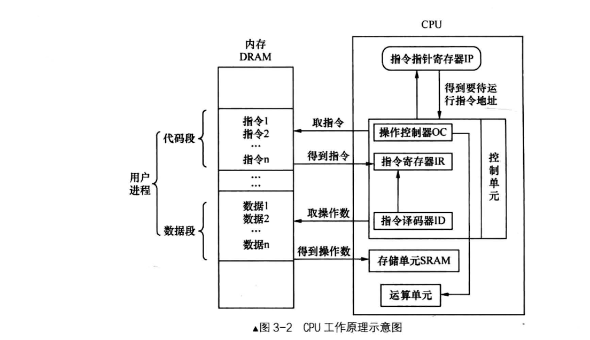
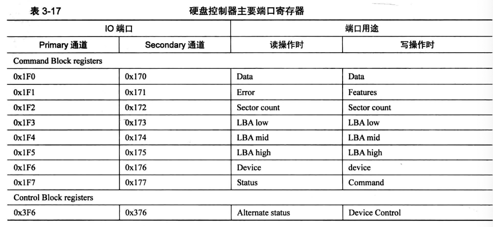

### 基础知识
#### 1 CPU工作原理：


#### 2 实模式
  1. 寄存器
    cpu的寄存器大致分为两类：
    - 一类是其内部使用，对程序员不可见（不可见指的是无法使用的意思），这些寄存器主要用来做数据的支持，给cpu内部数据提供存储空间。这一部分是我们无法使用的，比如：全局描述符表寄存器GDTR、中断描述符表寄存器IDTR、局部描述符表寄存器LDTR、任务寄存器TR、控制寄存器CR0～3、指令指针寄存器IP、标志寄存器flags、调试寄存器DR0～7。
    
    - 另一类寄存器就是程序员可见的，如段寄存器、通用寄存器。 
  2. 实模式下的CPU内存寻址方式：
    - 1 寄存器寻址；
    
     ```
     mov ax,0x10
     mov dx,0x9
     mul dx 
     ```
    - 2 立即数寻址；
    
     ```
     mov ax,0x18
     mov ds,ax
     ```
    - 3 内存寻址（他又可以分为四种）
      - 直接寻址
      
      ```
      mov ax,[0x1234]
      mov ax,[fs:0x5678]
      ```
      - 基址寻址

      ```
      基址寻址，就是在操作数中用bx寄存器或寄存器作为地址的起始，在实模式下必须用bx或bp寄存器，在保护模式下就没有了这个限制，基址寄存器的选择可以是全部的通用寄存器。bx寄存器的默认段寄存器是DS，而bp寄存器的默认段寄存器是SS，即bp和sp都是栈的有效地址，（有效地址就是指偏移地址）。
      sub sp,2
      mov sp,ax
      ```
      - 变址寻址

      ```
      变址寻址和基址寻址类似，只是寄存器由bx、bp换位了si和di，si是源索引寄存器，di是目的索引寄存器。两个寄存器的默认段寄存器也是DS。
      mov [di], ax
      add [si+0x1234], ax
      ```
      - 基地址变址寻址 

      ```
      mov [bx+di], ax
      add [bx+si], ax
      ```

#### 3 IO接口
  - IO接口是连接CPU和硬件的桥梁，端口是IO接口开放给CPU的接口。
  
  - in指令用于从端口中读取数据，其一般形式是：
  ```
  (1) in al,dx
  (2) in ax,dx
  其中al和ax用来存储从端口获取的数据，dx是指端口号。
  这是固定用法，只要用in指令，源操作数（端口号）必须是dx，而目的操作数是用al还是ax，取决于dx端口指代的寄存器是8位宽度还是16位宽度。
  ```
  - out指令用于往端口中写数据，其一般形式是：
  ```
  (1)out dx,al
  (2)out dx,ax
  (3)out 立即数,al
  (4)out 立即数,ax
  注：in指令中源操作数是端口号，而out指令的目的操作数是端口号。
  out指令中，可以选用dx或立即数充当端口号。
  ```
#### 4 硬盘控制器端口

  - 端口可分为两组，Command Block registers和Control Block registers，Command Block registers用于向硬盘驱动器写入命令字或者从硬盘控制器获取硬盘状态，Control Block registers用于控制硬盘工作状态。
  
  - data寄存器，其作用是读取或写入数据，在读硬盘时，硬盘准备好数据后，硬盘控制器将其放在内部的缓冲区中，不断读此寄存器便是读出缓冲区中的全部数据。在写硬盘时，我们要把数据源源不断地输送到此端口，数据便被存入缓冲区中，硬盘控制器发现这个缓冲区有数据了，便将此处的数据写入相应的扇区。
  - 读硬盘时，端口0x171和0x1F1的寄存器名字叫Error寄存器，只在硬盘读取失败时才有用，里面才会记录失败的信息。在写硬盘时，此寄存器有了新的作用，改名叫Feature寄存器，有些命令需要指定额外的参数，这些参数就写在Feature寄存器中，注意：error和feature这两个名字指的是同一个寄存器，只是因为不用环境下有不同的用途，为了区分用途才有了不同的名字，他们都是8位寄存器。
  - Sector count寄存器用来指定待读取或待写入的扇区数，硬盘每完成一个扇区，就会将此寄存器的值减1，如果中间失败了，此寄存器中的值便是尚未完成的扇区，他是8位寄存器，最大值为255，若指定为0，则表示要操作256个扇区。
  - LBA寄存器有：LBA low、LBA mid、LBA high三个，他们三个都是8位宽的，low用来存储28位地址的第0～7位，mid用来存储第8～15位，high用来存储第16～23位。
  - device寄存器，8位寄存器，低四位用来存储LBA地址的第24～27位，第四位用来指定通道上的主盘或从盘，0代表主盘，1代表从盘。第六位用来设置设置是否启用LBA方式，1代表LBA，0代表CHS。另外两位，第5位和第7位是固定为1的，称为MBS位。
  - 在读硬盘时，端口0x1f7或0x177的寄存器名称是status，8位寄存器，用来给出硬盘的状态信息。第0位是ERR位，如果此位为1，表示出错，具体原因可以查看error寄存器。第三位是data request位，如果此位为1，表示硬盘已经把数据准备好。第六位是DRDY，表示硬盘就绪，此位是在硬盘诊断时使用的。第7位是BSY，表示硬盘是否繁忙。
  - 在写硬盘时，端口0x1F7或0x177的寄存器名称是command，和上面说过的error和feature寄存器情况一样，此寄存器用来存储让硬盘执行的命令。主要会用到：0xEC，硬盘识别、0x20，读扇区、0x30，写扇区。
4. 硬盘操作步骤
   - 先选择通道，往该通道的sector count寄存器中写入待操作的扇区数
   - 往该通道上的三个LBA寄存器写入扇区起始地址的低24位。
   - 往device寄存器中写入LBA地址的24~27位，并置第6位为1，使其为LBA模式，设置第4位，选择操作的硬盘（master硬盘或slave硬盘）。
   - 往该通道上的command寄存器写入操作命令。
   - 读取该通道上的status寄存器，判断硬盘工作是否完成。
   - 如果以上步骤是读硬盘，进入下一个步骤。否则，完工。
   - 将硬盘数据读出。 


有注释代码mbr.S:
```
;主引导程序 
;------------------------------------------------------------
%include "boot.inc"
SECTION MBR vstart=0x7c00         
   mov ax,cs      
   mov ds,ax
   mov es,ax
   mov ss,ax
   mov fs,ax
   mov sp,0x7c00
   mov ax,0xb800
   mov gs,ax

; 清屏
;利用0x06号功能，上卷全部行，则可清屏。
; -----------------------------------------------------------
;INT 0x10   功能号:0x06	   功能描述:上卷窗口
;------------------------------------------------------
;输入：
;AH 功能号= 0x06
;AL = 上卷的行数(如果为0,表示全部)
;BH = 上卷行属性
;(CL,CH) = 窗口左上角的(X,Y)位置
;(DL,DH) = 窗口右下角的(X,Y)位置
;无返回值：
   mov     ax, 0600h
   mov     bx, 0700h
   mov     cx, 0                   ; 左上角: (0, 0)
   mov     dx, 184fh		   ; 右下角: (80,25),
				   ; 因为VGA文本模式中，一行只能容纳80个字符,共25行。
				   ; 下标从0开始，所以0x18=24,0x4f=79
   int     10h                     ; int 10h

   ; 输出字符串:MBR
   mov byte [gs:0x00],'1'
   mov byte [gs:0x01],0xA4

   mov byte [gs:0x02],' '
   mov byte [gs:0x03],0xA4

   mov byte [gs:0x04],'M'
   mov byte [gs:0x05],0xA4	   ;A表示绿色背景闪烁，4表示前景色为红色

   mov byte [gs:0x06],'B'
   mov byte [gs:0x07],0xA4

   mov byte [gs:0x08],'R'
   mov byte [gs:0x09],0xA4
	 
   mov eax,LOADER_START_SECTOR	 ; 起始扇区lba地址
   mov bx,LOADER_BASE_ADDR       ; 写入的地址
   mov cx,1			 ; 待读入的扇区数
   call rd_disk_m_16		 ; 以下读取程序的起始部分（一个扇区）
  
   jmp LOADER_BASE_ADDR
       
;-------------------------------------------------------------------------------
;功能:读取硬盘n个扇区
rd_disk_m_16:	   
;-------------------------------------------------------------------------------
				       ; eax=LBA扇区号
				       ; ebx=将数据写入的内存地址
				       ; ecx=读入的扇区数
      mov esi,eax	  ;备份eax
      mov di,cx		  ;备份cx
;读写硬盘:
;第1步：设置要读取的扇区数
      mov dx,0x1f2
      mov al,cl
      out dx,al            ;读取的扇区数

      mov eax,esi	   ;恢复ax

;第2步：将LBA地址存入0x1f3 ~ 0x1f6

      ;LBA地址7~0位写入端口0x1f3
      mov dx,0x1f3                       
      out dx,al                          

      ;LBA地址15~8位写入端口0x1f4
      mov cl,8
      shr eax,cl
      mov dx,0x1f4
      out dx,al

      ;LBA地址23~16位写入端口0x1f5
      shr eax,cl
      mov dx,0x1f5
      out dx,al

      shr eax,cl
      and al,0x0f	   ;lba第24~27位
      or al,0xe0	   ; 设置7〜4位为1110,表示lba模式
      mov dx,0x1f6
      out dx,al

;第3步：向0x1f7端口写入读命令，0x20 
      mov dx,0x1f7
      mov al,0x20                        
      out dx,al

;第4步：检测硬盘状态
  .not_ready:
      ;同一端口，写时表示写入命令字，读时表示读入硬盘状态
      nop
      in al,dx
      and al,0x88	   ;第4位为1表示硬盘控制器已准备好数据传输，第7位为1表示硬盘忙
      cmp al,0x08
      jnz .not_ready	   ;若未准备好，继续等。

;第5步：从0x1f0端口读数据
      mov ax, di
      mov dx, 256
      mul dx
      mov cx, ax	   ; di为要读取的扇区数，一个扇区有512字节，每次读入一个字，
			   ; 共需di*512/2次，所以di*256
      mov dx, 0x1f0
  .go_on_read:
      in ax,dx
      mov [bx],ax
      add bx,2		  
      loop .go_on_read
      ret

   times 510-($-$$) db 0
   db 0x55,0xaa

```  
loader.S:
```
%include "boot.inc"
section loader vstart=LOADER_BASE_ADDR

; 输出背景色绿色，前景色红色，并且跳动的字符串"1 MBR"
mov byte [gs:0x00],'2'
mov byte [gs:0x01],0xA4     ; A表示绿色背景闪烁，4表示前景色为红色

mov byte [gs:0x02],' '
mov byte [gs:0x03],0xA4

mov byte [gs:0x04],'L'
mov byte [gs:0x05],0xA4   

mov byte [gs:0x06],'O'
mov byte [gs:0x07],0xA4

mov byte [gs:0x08],'A'
mov byte [gs:0x09],0xA4

mov byte [gs:0x0a],'D'
mov byte [gs:0x0b],0xA4

mov byte [gs:0x0c],'E'
mov byte [gs:0x0d],0xA4

mov byte [gs:0x0e],'R'
mov byte [gs:0x0f],0xA4

jmp $		       ; 通过死循环使程序悬停在此

```

  