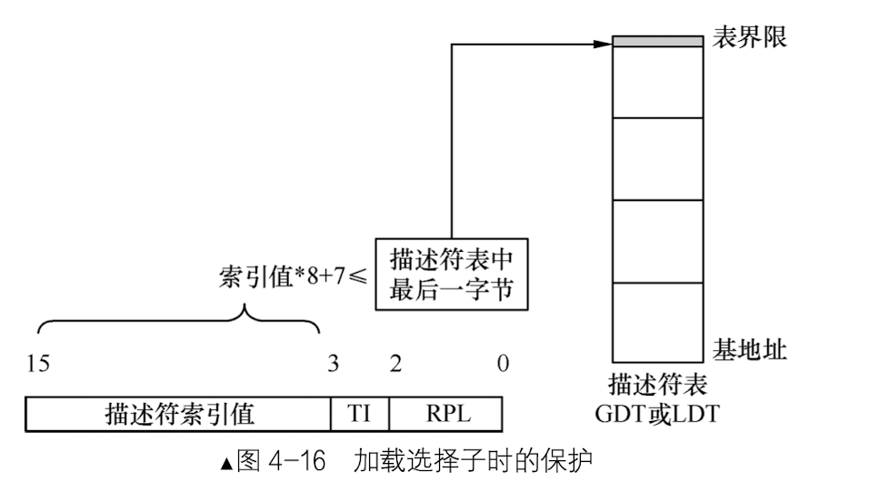
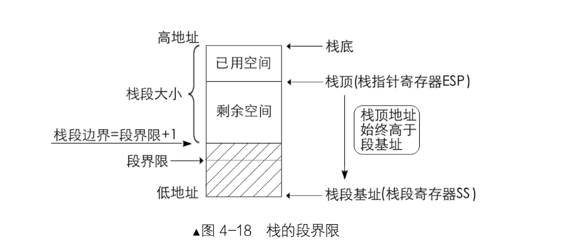

### 基础知识
####1. 段描述符


####2. 全局描述符表GDT、局部描述符表LDT及选择子
  - 全局描述符表GDT相当于是描述符的数组，数组中的每个元素8字节的描述符。可以用选择子中提供的下标在GDT中索引描述符。全局描述符表位于内存中，需要专门的寄存器指向它，也就是GDTR。
  
  - lgdt和GDTR：lgdt指令：lgdt 48位内存数据，其中前16位是GDT以字节为单位的界限值，相当于GDT字节大小减1。后32位是GDT的起始地址。由于GDT的大小是16位二进制，表示范围是2^16 = 65536字节。每个描述符大小是8字节，故GDT中最多可容纳的描述符数量是65536/8 = 8198，也就是可以容纳8192个段或门。
    
   - 按照CPU的设想，一个任务对应一个局部描述符表LDT，切换任务的时候也会切换LDT，LDT也存放在内存中，由LDTR寄存器指向，加载的指令为lldt。对于操作系统来说，每个系统必须定义一个GDT，用于系统中的所有任务和程序。可选择性定义若干个LDT。LDT本身是一个段，而GDT不是。
   - 选择子是16位的，其低2位0～1位，用来存储RPL，即请求特权级，可以表示0、1、2、3四种特权级。选择子的第二位是TI位，用来指示选择子是在GDT中，还是LDT中索引描述符。选择子的高13位，即3～15位是描述符的索引值，用此值在GDT中索引描述符。
     
       
####3. 准备进入保护模式
  - 1 打开A20
  - 2 加载gdt
  - 3 将cr0的pe位置1

   - 打开A20地址线

 ```
 in al, 0x92
 or al, 0000_0010B
 out 0x92, al
 打开的方式：将端口0x92的第一位置1。
 ```
 
   - CR0寄存器的PE位（保护模式的开关）

  ```
mov eax, cr0
or eax, 0x00000001
mov cr0, eax
  ```
    
   - 使用远跳指令清空流水线，更新段描述符缓冲寄存器
      -  代码段寄存器cs，只有用远过程调用指令call、远转移指令jmp、远返回指令retf等指令间接改变，没有直接改变cs的方法，另外，cpu遇到jmp指令时，之前已经送上流水线上的指令只有清空。
  
#### 4. CPU流水线
- CPU每条指令必须经过取指、译码、执行三步才算完成。
- CPU是按照程序中指令顺序来填充流水线的，也就是按照程序计数器PC（x86中是cs：ip）中的值来装载流水线的，当前指令和下一条指令在空间上是挨着的。如果当前执行的指令是jmp，下一条指令已经被送上流水线译码了，第三条指令已经送上流水线取指了，但是由于CPU已经跳到了别处执行，所以后面的指令用不到了，所以CPU在遇到无条件转移指令jmp时，会清空流水线。

#### 4.5 流水线的优化
- 乱序执行：乱序执行是指在CPU中运行的指令并不按照代码中的顺序执行，而是按照一定的策略打乱顺序执行，也许后面的指令先执行，当然得保证指令之间不具备相关性。
  - CISC和RISC
    
  - 以栈操作为例：
   
   ```
   mov eax, [0x1234]
   push eax
   call function
   ```
   第一步需要内存访问，由于内存较慢，所以寻址等待过程中可以做其他事情
   第二步的push指令可以拆为sub esp ，4 和 mov [esp], eax
   第三步的call函数调用，需要在栈中压入返回地址，所以说call指令需要用栈指针。
   由于第二步中的微操作sub esp，4可以让CPU知道esp的最新值，不用等到mov [esp], eax完成第三步call向栈中压入返回地址的操作就可以执行了。
   
- 缓存
  - 带执行的指令和相关数据存储在低速内存中，让CPU这种高速设备等待慢速的内存，太浪费CPU的资源了，于是我们使用了SRAM作为缓冲区，尽量让CPU不再等待。
  
  - CPU有一级缓存L1、二级缓存L2、甚至三级缓存L3等。他们都是SRAM，即静态随机访问存储器。无论是程序中的数据还是指令，在CPU眼中全是一样形式的二进制01串，没有任何区别，所以指令和数据都可以被缓存到SRAM中。

  - 分支预测 
  
  
#### 5. 内存段的保护
###### 向段寄存器加载选择子时的保护
  - 当引用一个内存段时，实际上就是往段寄存器中加载个选择子，为了防止出现非法引用的情况，处理器会在以下几方面作出检查：
  
  - 根据选择子的值验证段描述符是否超越界限。
    - 选择子的高13位是段描述符的索引，第0～1位是RPL，第二位是TI位。判断的标准是选择子的索引值一定要小于等于描述符表（GDT或LDT）的界限地址之内。每个段描述符的大小是8字节，所以在往段寄存器中加载选择子的时候，处理器要求选择子中的索引值满足：描述符表基地址+选择子中的索引值*8+7<=描述符表基地址+描述符表界限值。
      
    -  检查过程：处理器先检查TI的值，如果TI是0，则从全局描述符表寄存器gdtr中拿到GDT基地址和GDT界限值。（如果TI是1，则从局部描述符表寄存器ldtr中拿到LDT基地址和LDT界限值。）有了描述符表基地址和描述符表界限值之后就可以代入上述公式进行判断。
    -  段描述符中还有个type字段，用来表示段的类型，也就是不同的段有不同的作用。在选择子检查过后就要检查段的类型了。
      - 只有具备可执行属性的段（代码段）才能加载到CS段寄存器中。
      
      - 只具备执行属性的段（代码段）不允许加载到除CS外的段寄存器中。
      - 只有具备可写属性的段（数据段）才能加载到SS栈段寄存器中。
      - 至少具备可读属性的段才能加载到DS、ES、FS、GS段寄存器中。  
    
    - 检查完type后，还会检查段是否存在。利用的是段描述符中的P位来确认是否存在，如果p为1，则表示存在，这时就会将选择子载入到段寄存器中，同时段描述符缓冲寄存器也会更新为选择子对应的段描述符的内容，随后将段描述符中的A位置为1.如果p为0，则处理器抛出异常，自动去执行相应的异常处理程序，处理结束后将p位置为1，返回后CPU继续执行刚才的操作。

###### 2、代码段和数据段的保护
  - 代码段：
     - CS:IP指向的只是指令的起始地址，指令本身也有长度。CPU需要确保指令“完全、完整”地任意一部分都在当前的代码段内，需要满足：EIP中的偏移地址+指令长度-1<=实际段界限大小。
  - 数据段     
      - 数据也是有长度的（不同类型的数据的长度不一致这就是数据类型的作用），CPU也要保证操作数要“完全、完整”地任意一部分都在当前的数据段中，即满足：偏移地址+数据长度-1<=实际段界限大小。

###### 3、栈段的保护

 
 - 每次向栈中压入数据时就是CPU检查栈段的时机，需要满足的条件：实际段界限+1<=esp-操作数大小<=0xffffffff
  
### 有注释代码
loader.S
```
   %include "boot.inc"
   section loader vstart=LOADER_BASE_ADDR
   LOADER_STACK_TOP equ LOADER_BASE_ADDR
   jmp loader_start					; 此处的物理地址是:
   
;构建gdt及其内部的描述符
   GDT_BASE:   dd    0x00000000 
	       dd    0x00000000

   CODE_DESC:  dd    0x0000FFFF 
	       dd    DESC_CODE_HIGH4

   DATA_STACK_DESC:  dd    0x0000FFFF
		     dd    DESC_DATA_HIGH4

   VIDEO_DESC: dd    0x80000007	       ;limit=(0xbffff-0xb8000)/4k=0x7
	       dd    DESC_VIDEO_HIGH4  ; 此时dpl已改为0

   GDT_SIZE   equ   $ - GDT_BASE
   GDT_LIMIT   equ   GDT_SIZE -	1 
   times 60 dq 0					 ; 此处预留60个描述符的slot
   SELECTOR_CODE equ (0x0001<<3) + TI_GDT + RPL0         ; 相当于(CODE_DESC - GDT_BASE)/8 + TI_GDT + RPL0
   SELECTOR_DATA equ (0x0002<<3) + TI_GDT + RPL0	 ; 同上
   SELECTOR_VIDEO equ (0x0003<<3) + TI_GDT + RPL0	 ; 同上 

   ;以下是定义gdt的指针，前2字节是gdt界限，后4字节是gdt起始地址

   gdt_ptr  dw  GDT_LIMIT 
	    dd  GDT_BASE
   loadermsg db '2 loader in real.'

   loader_start:

;------------------------------------------------------------
;INT 0x10    功能号:0x13    功能描述:打印字符串
;------------------------------------------------------------
;输入:
;AH 子功能号=13H
;BH = 页码
;BL = 属性(若AL=00H或01H)
;CX＝字符串长度
;(DH、DL)＝坐标(行、列)
;ES:BP＝字符串地址 
;AL＝显示输出方式
;   0——字符串中只含显示字符，其显示属性在BL中。显示后，光标位置不变
;   1——字符串中只含显示字符，其显示属性在BL中。显示后，光标位置改变
;   2——字符串中含显示字符和显示属性。显示后，光标位置不变
;   3——字符串中含显示字符和显示属性。显示后，光标位置改变
;无返回值
   mov	 sp, LOADER_BASE_ADDR
   mov	 bp, loadermsg           ; ES:BP = 字符串地址
   mov	 cx, 17			 ; CX = 字符串长度
   mov	 ax, 0x1301		 ; AH = 13,  AL = 01h
   mov	 bx, 0x001f		 ; 页号为0(BH = 0) 蓝底粉红字(BL = 1fh)
   mov	 dx, 0x1800		 ;
   int	 0x10                    ; 10h 号中断

;----------------------------------------   准备进入保护模式   ------------------------------------------
									;1 打开A20
									;2 加载gdt
									;3 将cr0的pe位置1


   ;-----------------  打开A20  ----------------
   in al,0x92
   or al,0000_0010B
   out 0x92,al

   ;-----------------  加载GDT  ----------------
   lgdt [gdt_ptr]


   ;-----------------  cr0第0位置1  ----------------
   mov eax, cr0
   or eax, 0x00000001
   mov cr0, eax

   ;jmp dword SELECTOR_CODE:p_mode_start	     ; 刷新流水线，避免分支预测的影响,这种cpu优化策略，最怕jmp跳转，
   jmp  SELECTOR_CODE:p_mode_start	     ; 刷新流水线，避免分支预测的影响,这种cpu优化策略，最怕jmp跳转，
					     ; 这将导致之前做的预测失效，从而起到了刷新的作用。

[bits 32]
p_mode_start:
   mov ax, SELECTOR_DATA
   mov ds, ax
   mov es, ax
   mov ss, ax
   mov esp,LOADER_STACK_TOP
   mov ax, SELECTOR_VIDEO
   mov gs, ax

   mov byte [gs:160], 'P'

   jmp $

```
mbr.S
```
;主引导程序 
;------------------------------------------------------------
%include "boot.inc"
SECTION MBR vstart=0x7c00         
   mov ax,cs      
   mov ds,ax
   mov es,ax
   mov ss,ax
   mov fs,ax
   mov sp,0x7c00
   mov ax,0xb800
   mov gs,ax

; 清屏
;利用0x06号功能，上卷全部行，则可清屏。
; -----------------------------------------------------------
;INT 0x10   功能号:0x06	   功能描述:上卷窗口
;------------------------------------------------------
;输入：
;AH 功能号= 0x06
;AL = 上卷的行数(如果为0,表示全部)
;BH = 上卷行属性
;(CL,CH) = 窗口左上角的(X,Y)位置
;(DL,DH) = 窗口右下角的(X,Y)位置
;无返回值：
   mov     ax, 0600h
   mov     bx, 0700h
   mov     cx, 0                   ; 左上角: (0, 0)
   mov     dx, 184fh		   ; 右下角: (80,25),
				   ; 因为VGA文本模式中，一行只能容纳80个字符,共25行。
				   ; 下标从0开始，所以0x18=24,0x4f=79
   int     10h                     ; int 10h

   ; 输出字符串:MBR
   mov byte [gs:0x00],'1'
   mov byte [gs:0x01],0xA4

   mov byte [gs:0x02],' '
   mov byte [gs:0x03],0xA4

   mov byte [gs:0x04],'M'
   mov byte [gs:0x05],0xA4	   ;A表示绿色背景闪烁，4表示前景色为红色

   mov byte [gs:0x06],'B'
   mov byte [gs:0x07],0xA4

   mov byte [gs:0x08],'R'
   mov byte [gs:0x09],0xA4
	 
   mov eax,LOADER_START_SECTOR	 ; 起始扇区lba地址
   mov bx,LOADER_BASE_ADDR       ; 写入的地址
   mov cx,4			 ; 待读入的扇区数
   call rd_disk_m_16		 ; 以下读取程序的起始部分（一个扇区）
  
   jmp LOADER_BASE_ADDR
       
;-------------------------------------------------------------------------------
;功能:读取硬盘n个扇区
rd_disk_m_16:	   
;-------------------------------------------------------------------------------
				       ; eax=LBA扇区号
				       ; ebx=将数据写入的内存地址
				       ; ecx=读入的扇区数
      mov esi,eax	  ;备份eax
      mov di,cx		  ;备份cx
;读写硬盘:
;第1步：设置要读取的扇区数
      mov dx,0x1f2
      mov al,cl
      out dx,al            ;读取的扇区数

      mov eax,esi	   ;恢复ax

;第2步：将LBA地址存入0x1f3 ~ 0x1f6

      ;LBA地址7~0位写入端口0x1f3
      mov dx,0x1f3                       
      out dx,al                          

      ;LBA地址15~8位写入端口0x1f4
      mov cl,8
      shr eax,cl
      mov dx,0x1f4
      out dx,al

      ;LBA地址23~16位写入端口0x1f5
      shr eax,cl
      mov dx,0x1f5
      out dx,al

      shr eax,cl
      and al,0x0f	   ;lba第24~27位
      or al,0xe0	   ; 设置7〜4位为1110,表示lba模式
      mov dx,0x1f6
      out dx,al

;第3步：向0x1f7端口写入读命令，0x20 
      mov dx,0x1f7
      mov al,0x20                        
      out dx,al

;第4步：检测硬盘状态
  .not_ready:
      ;同一端口，写时表示写入命令字，读时表示读入硬盘状态
      nop
      in al,dx
      and al,0x88	   ;第4位为1表示硬盘控制器已准备好数据传输，第7位为1表示硬盘忙
      cmp al,0x08
      jnz .not_ready	   ;若未准备好，继续等。

;第5步：从0x1f0端口读数据
      mov ax, di
      mov dx, 256
      mul dx
      mov cx, ax	   ; di为要读取的扇区数，一个扇区有512字节，每次读入一个字，
			   ; 共需di*512/2次，所以di*256
      mov dx, 0x1f0
  .go_on_read:
      in ax,dx
      mov [bx],ax
      add bx,2		  
      loop .go_on_read
      ret

   times 510-($-$$) db 0
   db 0x55,0xaa
```
boot.inc
```
;-------------	 loader和kernel   ----------

LOADER_BASE_ADDR equ 0x900 
LOADER_START_SECTOR equ 0x2

;--------------   gdt描述符属性  -------------
DESC_G_4K   equ	  1_00000000000000000000000b   
DESC_D_32   equ	   1_0000000000000000000000b
DESC_L	    equ	    0_000000000000000000000b	;  64位代码标记，此处标记为0便可。
DESC_AVL    equ	     0_00000000000000000000b	;  cpu不用此位，暂置为0  
DESC_LIMIT_CODE2  equ 1111_0000000000000000b
DESC_LIMIT_DATA2  equ DESC_LIMIT_CODE2
DESC_LIMIT_VIDEO2  equ 0000_000000000000000b
DESC_P	    equ		  1_000000000000000b
DESC_DPL_0  equ		   00_0000000000000b
DESC_DPL_1  equ		   01_0000000000000b
DESC_DPL_2  equ		   10_0000000000000b
DESC_DPL_3  equ		   11_0000000000000b
DESC_S_CODE equ		     1_000000000000b
DESC_S_DATA equ	  DESC_S_CODE
DESC_S_sys  equ		     0_000000000000b
DESC_TYPE_CODE  equ	      1000_00000000b	;x=1,c=0,r=0,a=0 代码段是可执行的,非依从的,不可读的,已访问位a清0.  
DESC_TYPE_DATA  equ	      0010_00000000b	;x=0,e=0,w=1,a=0 数据段是不可执行的,向上扩展的,可写的,已访问位a清0.

DESC_CODE_HIGH4 equ (0x00 << 24) + DESC_G_4K + DESC_D_32 + DESC_L + DESC_AVL + DESC_LIMIT_CODE2 + DESC_P + DESC_DPL_0 + DESC_S_CODE + DESC_TYPE_CODE + 0x00
DESC_DATA_HIGH4 equ (0x00 << 24) + DESC_G_4K + DESC_D_32 + DESC_L + DESC_AVL + DESC_LIMIT_DATA2 + DESC_P + DESC_DPL_0 + DESC_S_DATA + DESC_TYPE_DATA + 0x00
DESC_VIDEO_HIGH4 equ (0x00 << 24) + DESC_G_4K + DESC_D_32 + DESC_L + DESC_AVL + DESC_LIMIT_VIDEO2 + DESC_P + DESC_DPL_0 + DESC_S_DATA + DESC_TYPE_DATA + 0x0b

;--------------   选择子属性  ---------------
RPL0  equ   00b
RPL1  equ   01b
RPL2  equ   10b
RPL3  equ   11b
TI_GDT	 equ   000b
TI_LDT	 equ   100b

```