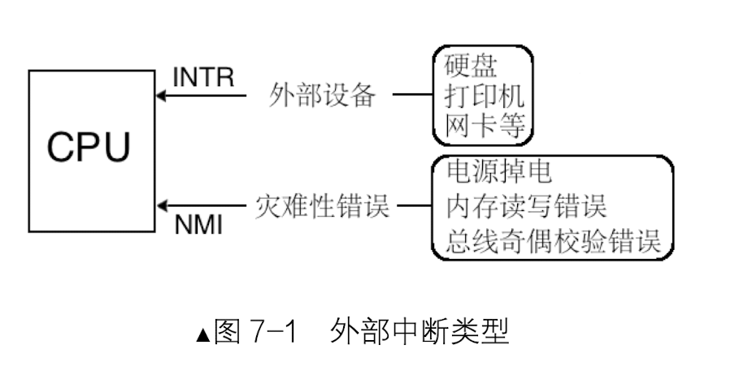
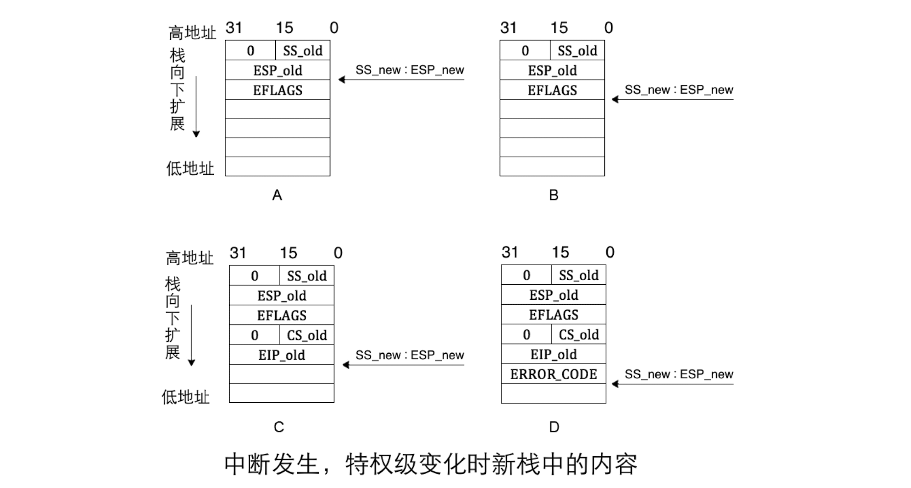
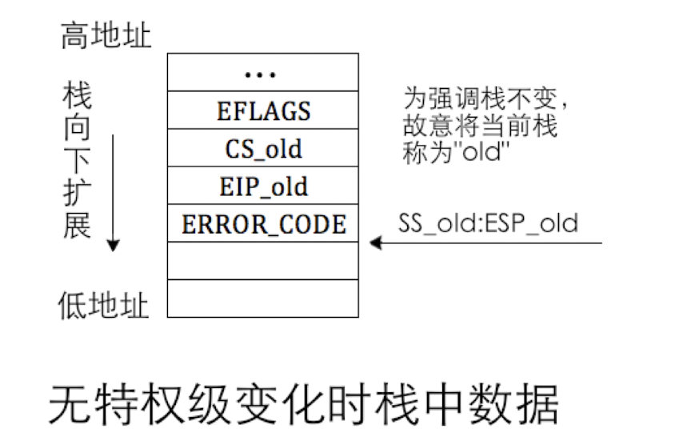
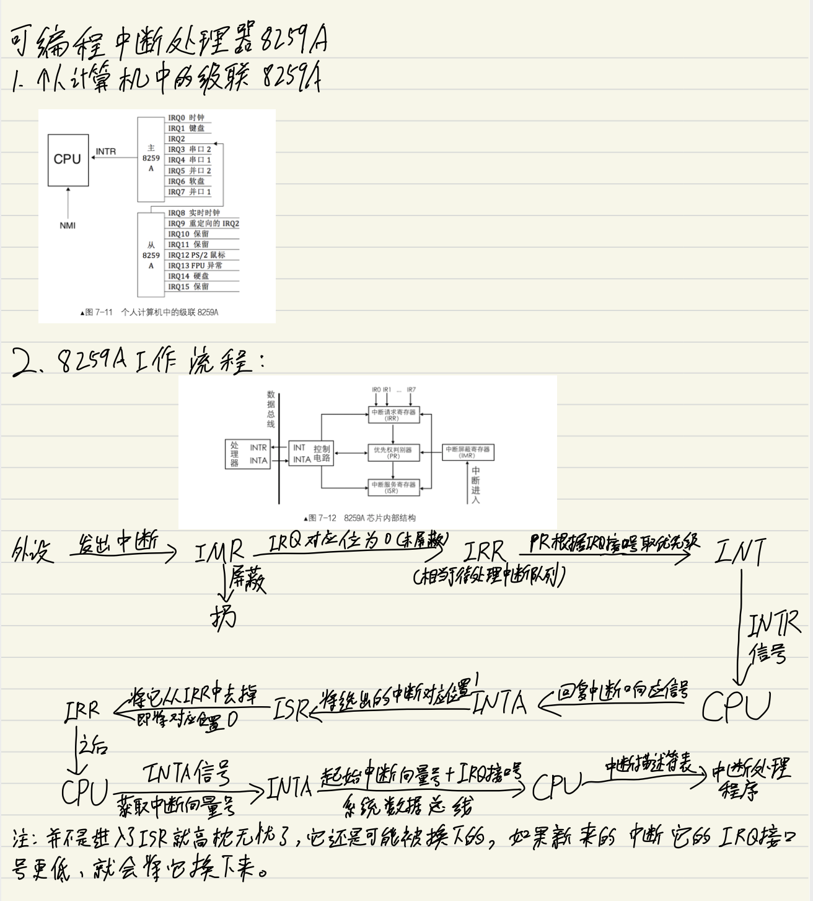
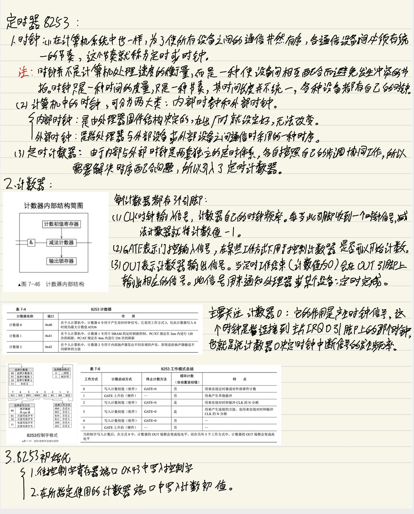

## 中断

##### 来一个经典语句😂
操作系统是个死循环，类似于下面的结构：
```
while(1)
{
    操作系统代码
}
```
这个死循环存在的意义是保证操作系统能够周而复始的运行下去，而运行的目的是为了等待某些事情的发生，也就是说操作系统是被动工作的，正因为如此，才说他是被事件驱动的，而这个事件正是以中断的形式通知操作系统的。


##### 中断分类
- 外部中断
  - 外部中断是指来自CPU外部的中断，而外部的中断源通常时某个硬件，所以外部的中断也叫硬件中断
  
  - 由于外部设备在种类和数量上都非常多，CPU不可能为每个外部设备专门设计一个接口去处理他的中断信号。所以只能提供统一的接口作为中断信号的公共线路，所有来自外设的中断信号都共享公共线路连接都CPU。
  - CPU为大家提供了两条信号线。外部硬件的中断是通过两根信号线通知CPU的，这两根信号线就是INTR和NMI，示意图如下：
    
  - 从INTR引脚收到的中断都是不影响系统运行的，可以随时处理，他不会影响到CPU的执行。也称为可屏蔽中断。可以通过eflag中的if位将所有这些外部中断屏蔽
  
  - 从NMI引脚收到的中断，通常是由于系统发生致命错误所导致的，比如电源掉电，内存读写错误等等。
  
- 内部中断
   - 内部中断可分为软中断和异常：软中断是由软件主动发起的中断，他是软件主动发起的。
   
   - 发起软中断有以下几种方式
     - int 8位的立即数 通过它，我们可以发起系统调用，8位的立即数可以表示256种中断。处理器支持的中断也是256种
    
     - int3 调试断点指令，在调式程序的时候，我们所下的断点就是通过他来实现的。通过调试器fork子进程，在断点处用int3替换原指令，从而使子进程调用int3触发中断
     - into 中断溢出指令，只有在eflags中的OF位为1的情况下才会被触发
     - bound 检查数组索引越界指令
     - ud2 未定义指令，CPU遇到无效指令时触发该中断
     - 异常是在指令执行期间CPU内部产生的错误引起的，由于是运行时错误，他不受eflags中的IF位的影响
   - 异常按照轻重的等级，可分为以下三种
     - Fault，也称故障。属于可被修复的一种类型，当发生此类异常时，CPU将机器状态恢复到异常之前的状态，之后调用中断处理程序，通常都能够被解决。缺页异常就属于此种异常
     
     - Trap，也称陷阱。此异常通常在调试中。
     - Abort，也称终止。程序发生了此类异常通常就无法继续执行下去，操作系统会将此程序从进程表中去除。 
  
  
##### 中断描述符表
- 简介：
   - 中断描述符表是保护模式下用于存储中断处理程序入口的表，当CPU接受到一个中断时，需要根据该中断的中断向量号在此表中检索对应的描述符，在该描述符中找到中断处理程序的起始地址，然后执行中断处理程序
   
- 中断描述符表中，不仅仅有中断描述符，还可以有任务门描述符、中断门描述符和陷阱门描述符。 

- 中断门：中断门包括了中断处理程序所在段选择子和段内偏移地址。当通过此方式进入中断后，标志寄存器eflags中的IF位自动置0，也就是在进入中断后，自动把中断关闭，避免中断嵌套。
- 陷阱门：陷阱门和中断门非常相似，区别是由中断门进入中断后，标志寄存器eflags中的IF位不会自动置0.
- 中断描述符表寄存器，该寄存器分为两部分：第0～15位是表界限，即IDT大小-1，第16～47位是IDT的基地址，同加载GDTR一样，加载IDTR也有个专门的指令--lidt，其用法是：lidt48位内存数据。
  
  
##### 中断处理过程及保护
- 完整的中断过程分为CPU内和CPU外两部分
  - CPU外：外部设备的中断由中断代理芯片接收，处理后将该中断的中断向量号发送到CPU。
  - CPU内：CPU执行该中断向量号对应的中断处理程序。
- 中断处理过程
  - 处理器根据中断向量号定位中断门描述符。
  - 处理器进行特权级检查。
  - 执行中断处理程序。
- 特权级检查：
  - 由于中断是通过中断向量号通知到处理器的，中断向量号只是个整数，其中并没有RPL，所以在对由中断引起的特权级转移做特权级检查中，不涉及RPL。
  - 如果是由软中断int n、int3和into引发的中断：
     - （a）、这些是用户进程主动发起的中断，由用户代码控制，处理器要检查当前特权级CPL和门描述符DPL，这是检查进门的特权下限，如果CPL权限大于等于DPL，特权级“门槛”检查成功，进入下一步的“门框”检查。否则，处理器抛出异常。
     - （b）、检查特权级的上限（门框）：处理器要检查当前特权级CPL和门描述符中所记录的选择子对应的目标代码段DPL，如果CPL权限小于目标代码段DPL，检查通过。否则CPL特权级若大于等于目标代码段DPL，处理器将引发异常，也就是说除了用返回指令从高特权级返回，特权转移只能发生在由低到高。
 - 若中断是由外部设备和异常引起的，只直接检查CPL和目标代码段的DPL，和上面的步骤b是一样的，要求CPL权限小于目标代码段DPL，否则处理器引发异常。   
- 执行中断处理程序
   - 特权级检查通过后，将门描述符目标代码段选择子加载到代码段寄存器CS中，把门描述符中中断处理程序的偏移地址加载到EIP，开始执行中断处理程序。
        

##### 中断发生时的压栈
 
 
- iret 指令会从栈顶依次弹出EIP、CS、EFLAGS，根据特权级的变化还有ESP、SS。但是该指令并不验证数据的正确性，而且他从栈中弹出数据的顺序是不变的，也就是说，在有error_code的情况下，iret返回时并不会主动跳过这个数据，需要我们手动进行处理
  
  
  
##### 手书
 

 
